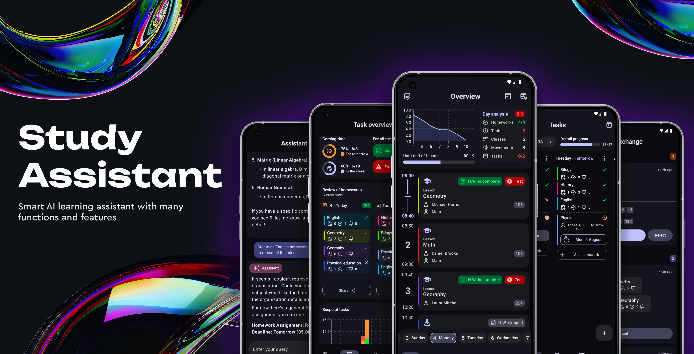
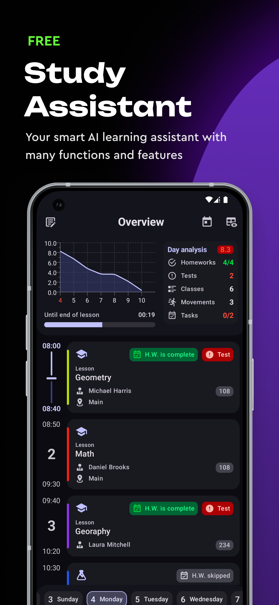
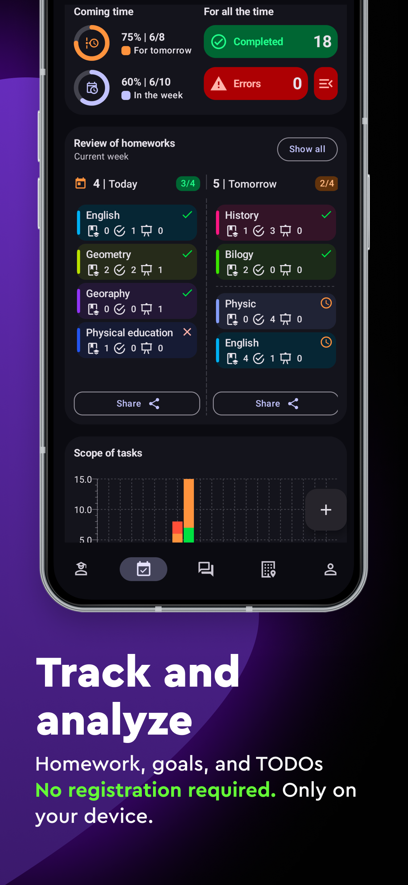
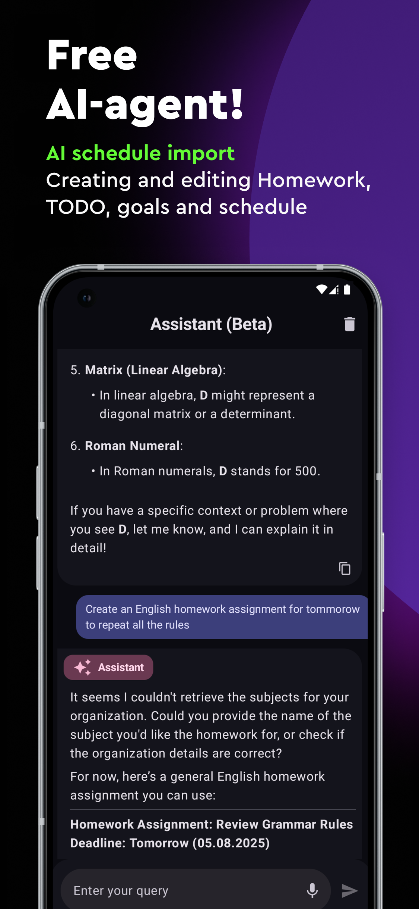
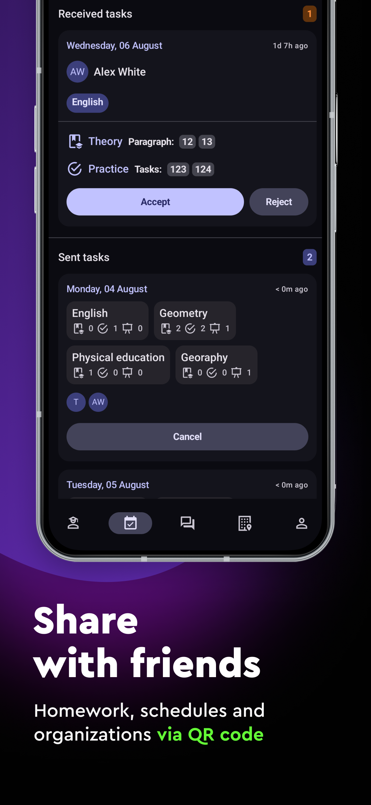
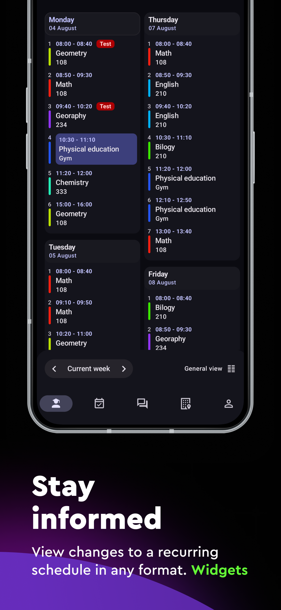
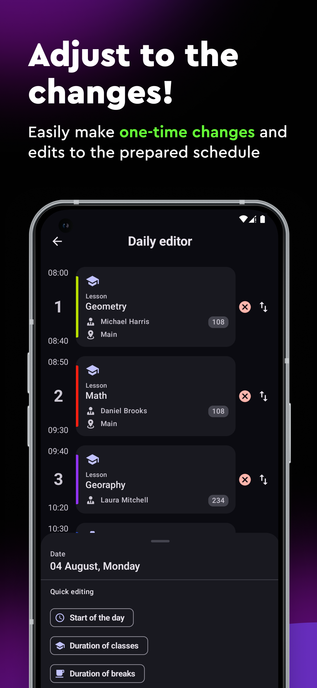
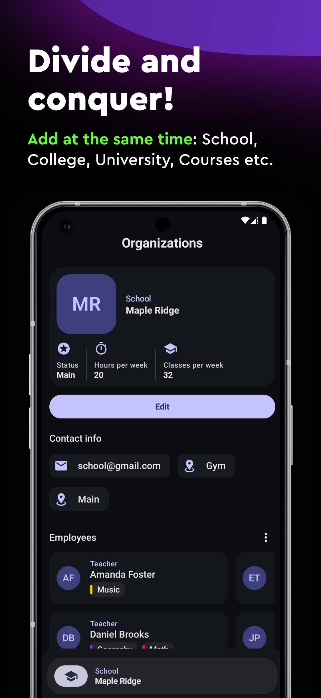
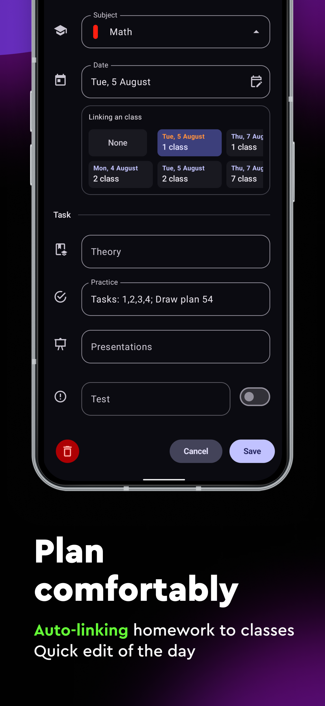
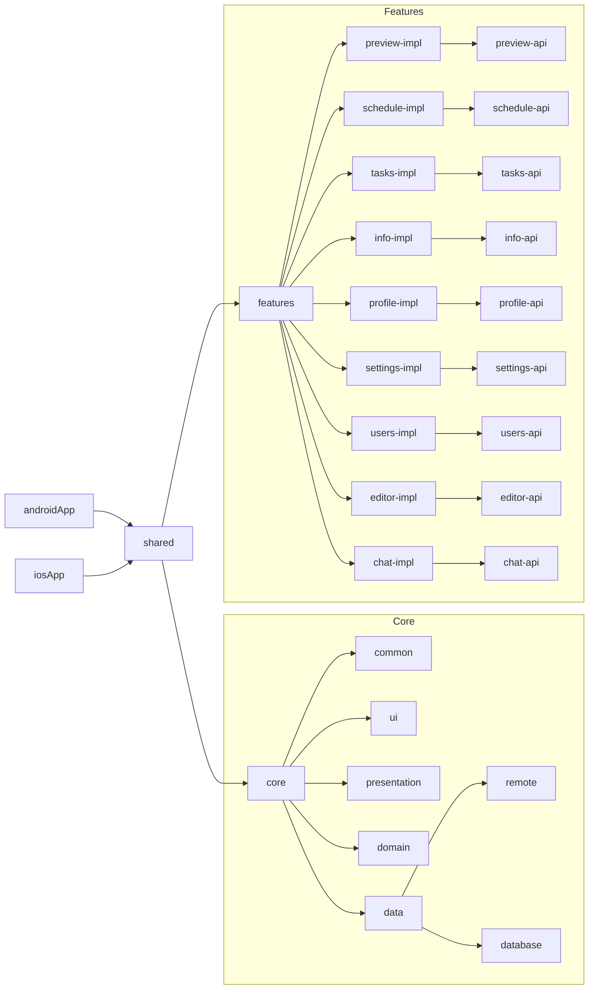

StudyAssistant
=

<p align="start">
  </a>
  </a>
  </br>
  </br>
  </a>
  </a>
  </a>
  </a>
  </a>
  </br>
  </br>
  <a href=""></a>
  <a href=""></a>
  <a href="https://github.com/v1tzor/StudyAssistant/stargazers"></a>
  <a href=""></a>
    </br>
  <a href="https://github.com/v1tzor/StudyAssistant/releases"></a>
  
  <a href=""></a>
  </br>
</p>

<div align="center">
</br>

<div align="start">

---

[](https://www.rustore.ru/catalog/app/ru.aleshin.studyassistant)[](https://github.com/v1tzor/StudyAssistant/releases/latest/download/1.0.0-studyassistant-github-release.apk)


## 🎓 Your Ultimate Academic Organizer

### 🤖 AI-Powered Study Assistant
Talk directly to your personal neural network assistant — a smart AI that not only chats but also creates tasks, schedules homework, analyzes your calendar, and even helps you solve academic problems. Whether you're planning your day or tackling tough assignments, the assistant is always by your side.

### 🎯 Daily Goals with Timer & Stopwatch
Set clear daily goals and stay on track with built-in timers and a stopwatch. Organize your homework, track your focus sessions, and never miss a task again — ideal for maintaining momentum and beating procrastination.

### 🌐 Offline by Design
Schedules, homework, TODOs, organizations, employees, subjects, settings, and your profile are stored locally and work without an account. Network access is used only when you explicitly share or import a schedule/homework item and when you use the AI assistant.

### 📚 Convenient Organization of Classes
Divide all classes, subjects and assignments by educational organizations – colleges, schools, courses, universities, etc. Work comfortably with each of them and get the most out of your learning processes.

### 🔗 Temporary Sharing
Share schedules and homework with a short-lived code or QR link. The recipient sees a preview before importing the data into their local database; friends, contacts, and cloud profiles are not required.

### ⏰ Flexible Scheduling
Design your recurring schedules with ease and make one-time adjustments for specific days. Change class durations, swap subjects, and keep a history of all schedule changes so you’re always on top of your time management.

### 📝 Smart Homework Management
Simplify your homework routine! Quickly add tasks and link them directly to your upcoming classes. During lessons, the app automatically determines the next subject, saving you time and effort. 

### 📊 Workload Statistics
Stay ahead of your tasks with real-time workload tracking! Monitor your weekly workload right on the home screen, and get detailed statistics on the number of tasks for each day, helping you plan your time more effectively.

### 🔔 Smart Notifications
Never miss a beat! Receive timely notifications about high workloads, incomplete assignments, and alerts for the beginning or end of lessons. Keeping up-to-date with your schedule has never been easier!

### ✅ Create Your Todo List
Organize your tasks effortlessly! Create and manage your personal TODO list, ensuring that you never miss an important deadline and stay one step ahead in your studies.

---

Start today with the Study Assistant app—a powerful tool to make your learning more efficient and organized! 🚀

---

> <picture>
>   <source media="(prefers-color-scheme: light)" srcset="https://raw.githubusercontent.com/Mqxx/GitHub-Markdown/main/blockquotes/badge/light-theme/info.svg">
>   
> </picture><br>
>
> Study data is stored locally on the device. Only data explicitly sent through temporary sharing and AI requests leaves the device. The application has no account, subscription, or background cloud synchronization.

# Screenshots

<div style="overflow-x:auto;">
  <table>
    <tbody>
      <tr>
        <td></td>
        <td></td>
        <td></td>
        <td></td>
      </tr>
      </tbody>
      <tbody>
      <tr>
        <td></td>
        <td></td>
        <td></td>
        <td></td>
      </tr>
      </tbody>
  </table>
</div>
 
###  

## Markets
| Service        | Availability |
| -------------- | ------------ |
| GitHub         | &check;      |
| RuStore        | &check;      |
| AppGallery     | &check;      |
| Play Market    | Planned      |
| App Store      | Planned      |

## Technical capabilities
| Platform       | Local data | Temporary sharing | AI | Local reminders |
| -------------- | ---------- | ----------------- | -- | --------------- |
| Android        | &check;    | &check;           | &check; | &check;   |
| iOS            | &check;    | &check;           | &check; | In progress |

# Project Dependencies

This project utilizes the following technologies and libraries:

## 📐 Architecture & Design Patterns
- **[Clean Architecture]()**: Implement a scalable and maintainable project structure.
- **[MVI (Model-View-Intent)]()**: A unidirectional data flow architecture pattern.
- **[Multi Modularity]()**: Structure the project into feature modules with `api` and `impl` layers.
- **[SOLID Principles](https://en.wikipedia.org/wiki/SOLID)**: Five principles for object-oriented design and programming.

## 💾 Data & Storage
- **[Kodein](https://kodein.org/di/)**: Dependency injection framework for Kotlin Multiplatform.
- **[SQLDelight](https://cashapp.github.io/sqldelight/)**: Type-safe SQL for Kotlin Multiplatform.
- **[filekit](https://github.com/vinceglb/filekit)**: A library for file management.

## 🌐 Networking & API
- **[Ktor](https://ktor.io/)**: Asynchronous HTTP client and server framework for Kotlin.
- **[PostgreSQL](https://www.postgresql.org/)**: Transactional quotas and encrypted temporary sharing storage.
- **[DeepSeek API](https://api-docs.deepseek.com/)**: Server-side shared AI through the fixed Flash model.

Release/archive builds require the public Ktor endpoint explicitly via
`-Pstudyassistant.backend.url=https://api.studyassistant-app.ru` or
`STUDYASSISTANT_BACKEND_URL`; provider keys and other privileged secrets never enter the mobile binary.
For Android emulator development use
`-Pstudyassistant.backend.url=http://10.0.2.2:8080`; cleartext traffic is enabled only in debug builds.
- **[Tracer](https://apptracer.ru/)**: Android crash reporting.
- **[MyTracker](https://tracker.my.com/ru/)**: Android analytics.

## 🎨 UI & Navigation
- **[Compose Material 3](https://developer.android.com/jetpack/compose/material)**: Material Design components for Jetpack Compose.
- **[Decompose](https://github.com/arkivanov/Decompose)**: Multiplatform navigation library for Jetpack Compose.
- **[koalaplot-charts](https://github.com/JetBrains/compose-jb/tree/master/examples/Charts/koalaplot)**: Multiplatform chart library for Compose.
- **[sketch-compose](https://github.com/sketch-compose/sketch-compose)**: Lightweight image loading library for Jetpack Compose.

## 🛠️ Android Specific
- **[Android WorkManager](https://developer.android.com/topic/libraries/architecture/workmanager)**: Manage background tasks on Android.
- **[Android BuildFlavors](https://developer.android.com/studio/build/build-variants)**: Configure different versions of your app.

## 📅 Utilities
- **[Kotlinx-datetime](https://github.com/Kotlin/kotlinx-datetime)**: Date and time library for Kotlin Multiplatform.
- **[Kotlin Coroutines and Flows](https://kotlinlang.org/docs/coroutines-overview.html)**: Asynchronous programming with coroutines and flows.
- **[Logger](https://github.com/touchlab/Kermit)**: Multiplatform logging library.

## 🛠️ Tooling & Build Systems
- **[KSP (Kotlin Symbol Processing)](https://github.com/google/ksp)**: Lightweight compiler plugin for Kotlin.
- **[Gradle KTS](https://docs.gradle.org/current/userguide/kotlin_dsl.html)**: Gradle build scripts with Kotlin DSL.
- **[Detekt](https://detekt.github.io/detekt/) & [Lint](https://developer.android.com/studio/write/lint)**: Static code analysis tools.
- **[BuildKonfig](https://github.com/yshrsmz/BuildKonfig)**: Multiplatform configuration management.

This list provides an overview of the key technologies and libraries used in this Kotlin Multiplatform project. For detailed documentation and usage, please refer to the linked resources.


# Project Modules

```mermaid
graph LR;
    androidApp --> shared
    iosApp --> shared

    shared --> core

    subgraph one [Core]
    direction LR;
    core --> common & ui & presentation & domain & data
    data --> remote & database
    end

    shared --> features

    subgraph two [Features]
    direction LR;
    features --> preview-impl --> preview-api
    features --> schedule-impl --> schedule-api
    features --> tasks-impl --> tasks-api
    features --> info-impl --> info-api
    features --> profile-impl --> profile-api
    features --> settings-impl --> settings-api
    features --> users-impl --> users-api
    features --> editor-impl --> editor-api
    features --> chat-impl --> chat-api
    end
```

# License

```
Copyright 2026 Stanislav Aleshin

Licensed under the Apache License, Version 2.0 (the "License");
you may not use this file except in compliance with the License.
You may obtain a copy of the License at

http://www.apache.org/licenses/LICENSE-2.0

Unless required by applicable law or agreed to in writing, software
distributed under the License is distributed on an "AS IS" BASIS,
WITHOUT WARRANTIES OR CONDITIONS OF ANY KIND, either express or implied.
See the License for the specific language governing permissions and
limitations under the License.
```
