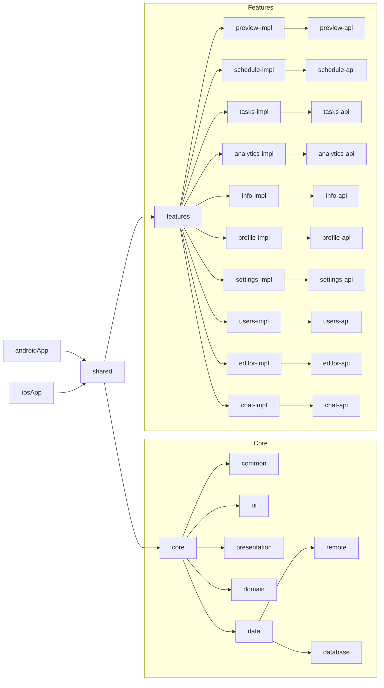

StudyAssistant
=

<p align="start">
  </a>
  </a>
  </br>
  </br>
  </a>
  </a>
  </a>
  </a>
  </a>
  </br>
  </br>
  <a href=""></a>
  <a href=""></a>
  <a href="https://github.com/v1tzor/StudyAssistant/stargazers"></a>
  <a href=""></a>
    </br>
  <a href="https://github.com/v1tzor/StudyAssistant/releases"></a>
  
  <a href=""></a>
  </br>
</p>


---

[](https://www.rustore.ru/catalog/app/ru.aleshin.studyassistant)[](https://github.com/v1tzor/StudyAssistant/releases/latest/download/1.0.0-studyassistant-github-release.apk)


## 🎓 Your Ultimate Academic Organizer

StudyAssistant is a **completely free** planner for school, college, and university. There is no subscription, no account, and no cloud copy of your diary. Your schedule, homework, TODOs, organizations, and profile stay on the device.

> **Free forever.** Every feature is included. We do not collect personal identity — no email, no sign-in, no friends graph.

### 🌐 Offline by design
Classes, homework, TODOs, organizations, employees, subjects, settings, and your local profile work without the internet. The network is used only when you choose to share or import something, talk to the assistant, or import a timetable from a photo.

### 📚 Organizations & classes
Keep school, college, courses, and university in separate organizations. Subjects, teachers, classrooms, and assignments stay grouped where they belong.

### 📷 Import a timetable from a photo
Photograph a timetable (table, diary, or weekly grid). Review the draft, fix times if needed, then apply it locally — including rooms and locations when they are on the image.

### ⏰ Flexible scheduling
Build a repeating week and override a single day when the plan changes. Adjust start times, lesson length, and breaks without rebuilding the whole timetable.

### 📝 Homework linked to classes
Add homework and attach it to the next lesson of a subject. During the day the app already knows what is coming up, so you are not hunting through the week by hand.

### 🤖 AI assistant
Chat in the app about *your* local data. The assistant can look up organizations, subjects, and classes, then **propose** homework or TODOs — nothing is written until you confirm. History stays on the device. A shared daily quota keeps the service free for everyone.

### 🔗 Temporary sharing
Hand someone a short code or QR link for a schedule or homework item. They preview it, then import into their own local database. No friend list, no cloud profile, no permanent link.

### 🎯 Daily goals & timers
Set the day’s goals and track them with a timer or stopwatch so focus sessions stay honest.

### ✅ TODO list
Keep personal tasks next to homework — with reminders, not with another login.

### 📊 Workload
See the week’s load on the home screen and how many tasks sit on each day before it piles up.

### 🔔 Notifications
Get alerts for the start and end of classes, unfinished homework, and a heavy day. Full reminder coverage is on Android; iOS is still catching up.

---

# Screenshots

<div style="overflow-x:auto;">
  <table>
    <tbody>
      <tr>
        <td></td>
        <td></td>
        <td></td>
        <td></td>
      </tr>
      </tbody>
      <tbody>
      <tr>
        <td></td>
        <td></td>
        <td></td>
        <td></td>
      </tr>
      </tbody>
  </table>
</div>

## Privacy & staying free

Your timetable, homework, messages, and profile **do not leave the phone** as a backup or an account. There is no sign-in and we do not collect personal data such as email, phone number, or a public user profile.

The only things that go over the network are what you explicitly send:

- a temporary share you create (encrypted in transit, short-lived on the server)
- an AI chat turn or a photo used to extract a timetable
- optional ads / a rewarded ad if you want extra AI messages

**[AppMetrica](https://appmetrica.yandex.ru/)** records crashes and coarse product usage so we can keep AI and sharing online without charging you. It is not a dump of your classes or homework, we do not sell study data, and we do not turn it into a marketing profile of you.

Short Yandex ads (and an optional rewarded ad for extra AI messages) exist for the same reason: they pay for the shared backend, not for unlocking the app.

## Markets
| Service        | Availability |
| -------------- | ------------ |
| GitHub         | &check;      |
| RuStore        | &check;      |
| AppGallery     | &check;      |
| Play Market    | Planned      |
| App Store      | Planned      |

## Technical capabilities
| Platform       | Local data | Temporary sharing | AI | Local reminders |
| -------------- | ---------- | ----------------- | -- | --------------- |
| Android        | &check;    | &check;           | &check; | &check;   |
| iOS            | &check;    | &check;           | &check; | In progress |

# Project Dependencies

This project utilizes the following technologies and libraries:

## 📐 Architecture & Design Patterns
- **[Clean Architecture]()**: Implement a scalable and maintainable project structure.
- **[MVI (Model-View-Intent)]()**: A unidirectional data flow architecture pattern.
- **[Multi Modularity]()**: Structure the project into feature modules with `api` and `impl` layers.
- **[SOLID Principles](https://en.wikipedia.org/wiki/SOLID)**: Five principles for object-oriented design and programming.

## 💾 Data & Storage
- **[Kodein](https://kodein.org/di/)**: Dependency injection framework for Kotlin Multiplatform.
- **[SQLDelight](https://cashapp.github.io/sqldelight/)**: Type-safe SQL for Kotlin Multiplatform.
- **[filekit](https://github.com/vinceglb/filekit)**: A library for file management.

## 🌐 Networking & API
- **[Ktor](https://ktor.io/)**: Asynchronous HTTP client and server framework for Kotlin.
- **[PostgreSQL](https://www.postgresql.org/)**: Transactional quotas and encrypted temporary sharing storage.
- **[DeepSeek API](https://api-docs.deepseek.com/)**: Server-side shared AI through the fixed Flash model.
- **[Tracer](https://apptracer.ru/)**: Android crash reporting.
- **[AppMetrica](https://appmetrica.yandex.ru/)**: Crash and usage analytics for the shared AI and sharing backend.

## 🎨 UI & Navigation
- **[Compose Material 3](https://developer.android.com/jetpack/compose/material)**: Material Design components for Jetpack Compose.
- **[Decompose](https://github.com/arkivanov/Decompose)**: Multiplatform navigation library for Jetpack Compose.
- **[koalaplot-charts](https://github.com/JetBrains/compose-jb/tree/master/examples/Charts/koalaplot)**: Multiplatform chart library for Compose.
- **[sketch-compose](https://github.com/sketch-compose/sketch-compose)**: Lightweight image loading library for Jetpack Compose.

## 🛠️ Android Specific
- **[Android WorkManager](https://developer.android.com/topic/libraries/architecture/workmanager)**: Manage background tasks on Android.
- **[Android BuildFlavors](https://developer.android.com/studio/build/build-variants)**: Configure different versions of your app.

## 📅 Utilities
- **[Kotlinx-datetime](https://github.com/Kotlin/kotlinx-datetime)**: Date and time library for Kotlin Multiplatform.
- **[Kotlin Coroutines and Flows](https://kotlinlang.org/docs/coroutines-overview.html)**: Asynchronous programming with coroutines and flows.
- **[Logger](https://github.com/touchlab/Kermit)**: Multiplatform logging library.

## 🛠️ Tooling & Build Systems
- **[KSP (Kotlin Symbol Processing)](https://github.com/google/ksp)**: Lightweight compiler plugin for Kotlin.
- **[Gradle KTS](https://docs.gradle.org/current/userguide/kotlin_dsl.html)**: Gradle build scripts with Kotlin DSL.
- **[Detekt](https://detekt.github.io/detekt/) & [Lint](https://developer.android.com/studio/write/lint)**: Static code analysis tools.
- **[BuildKonfig](https://github.com/yshrsmz/BuildKonfig)**: Multiplatform configuration management.

This list provides an overview of the key technologies and libraries used in this Kotlin Multiplatform project. For detailed documentation and usage, please refer to the linked resources.


# Project Modules

```mermaid
graph LR;
    androidApp --> shared
    iosApp --> shared

    shared --> core

    subgraph one [Core]
    direction LR;
    core --> common & ui & presentation & domain & data
    data --> remote & database
    end

    shared --> features

    subgraph two [Features]
    direction LR;
    features --> preview-impl --> preview-api
    features --> schedule-impl --> schedule-api
    features --> tasks-impl --> tasks-api
    features --> analytics-impl --> analytics-api
    features --> info-impl --> info-api
    features --> profile-impl --> profile-api
    features --> settings-impl --> settings-api
    features --> users-impl --> users-api
    features --> editor-impl --> editor-api
    features --> chat-impl --> chat-api
    end
```

# License

```
Copyright 2026 Stanislav Aleshin

Licensed under the Apache License, Version 2.0 (the "License");
you may not use this file except in compliance with the License.
You may obtain a copy of the License at

http://www.apache.org/licenses/LICENSE-2.0

Unless required by applicable law or agreed to in writing, software
distributed under the License is distributed on an "AS IS" BASIS,
WITHOUT WARRANTIES OR CONDITIONS OF ANY KIND, either express or implied.
See the License for the specific language governing permissions and
limitations under the License.
```
