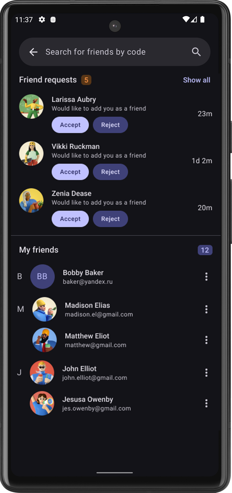

StudyAssistant
=

<p align="start">
  </a>
  </a>
  </br>
  </br>
  </a>
  </a>
  </a>
  </a>
  </a>
  </br>
  </br>
  <a href=""></a>
  <a href=""></a>
  <a href="https://github.com/v1tzor/StudyAssistant/stargazers"></a>
  <a href=""></a>
    </br>
  <a href="https://github.com/v1tzor/StudyAssistant/releases"></a>
  
  <a href=""></a>
  </br>
</p>

<div align="center">
</br>

<div align="start">

## Your Ultimate Academic Organizer

### 📚 Convenient Organization of Classes
Divide all classes, subjects and assignments by educational organizations – colleges, schools, courses, universities, etc. Work comfortably with each of them and get the most out of your learning processes.

### 👥 Share with Friends
Stay connected with your friends! Add them to your network and share your schedules and homework from any organization. Share valuable information, stay in sync, and help each other succeed!

### ⏰ Flexible Scheduling
Design your recurring schedules with ease and make one-time adjustments for specific days. Change class durations, swap subjects, and keep a history of all schedule changes so you’re always on top of your time management.

### 📝 Smart Homework Management
Simplify your homework routine! Quickly add tasks and link them directly to your upcoming classes. During lessons, the app automatically determines the next subject, saving you time and effort. 

### 📊 Workload Statistics
Stay ahead of your tasks with real-time workload tracking! Monitor your weekly workload right on the home screen, and get detailed statistics on the number of tasks for each day, helping you plan your time more effectively.

### 🔔 Smart Notifications
Never miss a beat! Receive timely notifications about high workloads, incomplete assignments, and alerts for the beginning or end of lessons. Keeping up-to-date with your schedule has never been easier!

### ✅ Create Your Todo List
Organize your tasks effortlessly! Create and manage your personal TODO list, ensuring that you never miss an important deadline and stay one step ahead in your studies.

---

Start today with the Study Assistant app—a powerful tool to make your learning more efficient and organized! 🚀

---

> <picture>
>   <source media="(prefers-color-scheme: light)" srcset="https://raw.githubusercontent.com/Mqxx/GitHub-Markdown/main/blockquotes/badge/light-theme/info.svg">
>   
> </picture><br>
>
> We do not share your account data with third parties without your consent. All information is securely stored on our Firestore servers (Data of schedules, tasks, etc. are currently stored only in your phone's memory).

# Screenshots

<div style="overflow-x:auto;">
  <table>
    <thead>
      <tr>
        <th>Login Screen</th>
        <th>Register Screen</th>
        <th>Forgot Screen</th>
        <th>Verification Screen</th>
      </tr>
    </thead>
    <tbody>
      <tr>
        <td></td>
        <td></td>
        <td></td>
        <td></td>
      </tr>
    </tbody>
    <thead>
      <tr>
        <th>Schedule Overview</th>
        <th>Class Bottom Sheet</th>
        <th>Schedule Details</th>
        <th>Vertical Details</th>
      </tr>
    </thead>
    <tbody>
      <tr>
        <td></td>
        <td></td>
        <td></td>
        <td></td>
      </tr>
    </tbody>
    <thead>
      <tr>
        <th>Tasks Overview</th>
        <th>Tasks Overview 2</th>
        <th>Homeworks</th>
        <th>Todos</th>
      </tr>
    </thead>
    <tbody>
      <tr>
        <td></td>
        <td></td>
        <td></td>
        <td></td>
      </tr>
    </tbody>
    <thead>
      <tr>
        <th>Organizations</th>
        <th>Organizations 2</th>
        <th>Subjects</th>
        <th>Employee</th>
      </tr>
    </thead>
    <tbody>
      <tr>
        <td></td>
        <td></td>
        <td></td>
        <td></td>
      </tr>
    </tbody>
    <thead>
      <tr>
        <th>Profile</th>
        <th>Friends</th>
        <th>Share Schedule</th>
        <th>Share Tasks</th>
      </tr>
    </thead>
    <tbody>
      <tr>
        <td></td>
        <td></td>
        <td></td>
        <td></td>
      </tr>
    </tbody>
    <thead>
      <tr>
        <th>Daily Schedule Editor</th>
        <th>Week Schedule Editor</th>
        <th>Class Editor</th>
        <th>Homeworks Editor</th>
      </tr>
    </thead>
    <tbody>
      <tr>
        <td></td>
        <td></td>
        <td></td>
        <td></td>
      </tr>
    </tbody>
  </table>
</div>

## Markets
| Service        | Free version   | Subscription version |
| -------------- | -------------- | -------------------- |
| Github         | &check;        | &cross;              |
| Fdoroid        | In progress    | &cross;              |
| RuStore        | In planned     | In planned           |
| Play Market    | In planned     | In planned           |
| App gallery    | In planned     | In planned           |
| App Store      | In planned     | In planned           |

## Technical capabilities
| Flavor         | Crashlytics    | Firestore         | Messaging      | Reminders |
| -------------- | -------------- | ----------------- | -------------- | --------- |
| Github         | &check;        | &check; (GMS)     | FMS            | &check; |
| Fdoroid        | &cross;        | Only Network      | &cross;        | &check; |
| RuStore        | &check;        | &check; (GMS)     | FCM, RUSTORE   | &check; |
| Google         | &check;        | &check; (GMS)     | FCM            | &check; |
| Huawei         | In planned     | In planned        | In planned (HCM, FMS) | &check; |
| Apple          | In progress    | &check;           | In planned (APNS) | In planned |

# Project Dependencies

This project utilizes the following technologies and libraries:

## 📐 Architecture & Design Patterns
- **[Clean Architecture]()**: Implement a scalable and maintainable project structure.
- **[MVI (Model-View-Intent)]()**: A unidirectional data flow architecture pattern.
- **[Multi Modularity]()**: Structure the project into feature modules with `api` and `impl` layers.
- **[SOLID Principles](https://en.wikipedia.org/wiki/SOLID)**: Five principles for object-oriented design and programming.

## 💾 Data & Storage
- **[Kodein](https://kodein.org/di/)**: Dependency injection framework for Kotlin Multiplatform.
- **[SQLDelight](https://cashapp.github.io/sqldelight/)**: Type-safe SQL for Kotlin Multiplatform.
- **[filekit](https://github.com/vinceglb/filekit)**: A library for file management.

## 🌐 Networking & API
- **[Ktor](https://ktor.io/)**: Asynchronous HTTP client and server framework for Kotlin.
- **[Google OAuth 2.0](https://developers.google.com/identity/protocols/oauth2)**: Secure authorization for Google APIs.
- **[Firebase Firestore](https://firebase.google.com/docs/firestore)**: NoSQL cloud database for mobile and web apps.
- **[Firebase Authorization](https://firebase.google.com/docs/auth)**: Authentication services for your app.
- **[Firebase Messaging](https://firebase.google.com/docs/cloud-messaging)**: Messaging and notifications.
- **[Firebase Storage](https://firebase.google.com/docs/storage)**: File storage for your app.
- **[Firebase Crashlytics](https://firebase.google.com/docs/crashlytics)**: Real-time crash reporting.
- **[Rustore UniversalPush](https://www.rustore.ru/help/sdk/general-push-notifications)**: Push notifications for alternative app stores.

## 🎨 UI & Navigation
- **[Compose Material 3](https://developer.android.com/jetpack/compose/material)**: Material Design components for Jetpack Compose.
- **[Voyager](https://github.com/adrielcafe/voyager)**: Multiplatform navigation library for Jetpack Compose.
- **[koalaplot-charts](https://github.com/JetBrains/compose-jb/tree/master/examples/Charts/koalaplot)**: Multiplatform chart library for Compose.
- **[sketch-compose](https://github.com/sketch-compose/sketch-compose)**: Lightweight image loading library for Jetpack Compose.

## 🛠️ Android Specific
- **[Android WorkManager](https://developer.android.com/topic/libraries/architecture/workmanager)**: Manage background tasks on Android.
- **[Android BuildFlavors](https://developer.android.com/studio/build/build-variants)**: Configure different versions of your app.

## 📅 Utilities
- **[Kotlinx-datetime](https://github.com/Kotlin/kotlinx-datetime)**: Date and time library for Kotlin Multiplatform.
- **[Kotlin Coroutines and Flows](https://kotlinlang.org/docs/coroutines-overview.html)**: Asynchronous programming with coroutines and flows.
- **[Logger](https://github.com/touchlab/Kermit)**: Multiplatform logging library.

## 🛠️ Tooling & Build Systems
- **[KSP (Kotlin Symbol Processing)](https://github.com/google/ksp)**: Lightweight compiler plugin for Kotlin.
- **[Gradle KTS](https://docs.gradle.org/current/userguide/kotlin_dsl.html)**: Gradle build scripts with Kotlin DSL.
- **[Detekt](https://detekt.github.io/detekt/) & [Lint](https://developer.android.com/studio/write/lint)**: Static code analysis tools.
- **[BuildKonfig](https://github.com/yshrsmz/BuildKonfig)**: Multiplatform configuration management.

This list provides an overview of the key technologies and libraries used in this Kotlin Multiplatform project. For detailed documentation and usage, please refer to the linked resources.


# Project Modules


# License

```
Copyright 2024 Stanislav Aleshin

Licensed under the Apache License, Version 2.0 (the "License");
you may not use this file except in compliance with the License.
You may obtain a copy of the License at

http://www.apache.org/licenses/LICENSE-2.0

Unless required by applicable law or agreed to in writing, software
distributed under the License is distributed on an "AS IS" BASIS,
WITHOUT WARRANTIES OR CONDITIONS OF ANY KIND, either express or implied.
See the License for the specific language governing permissions and
limitations under the License.
```
